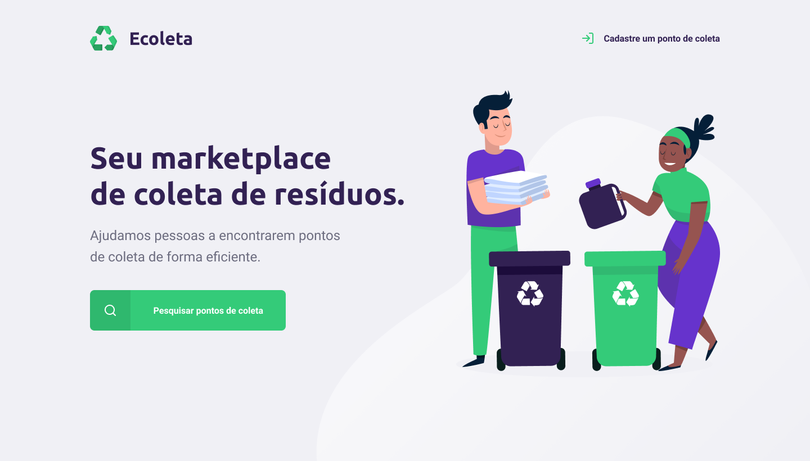
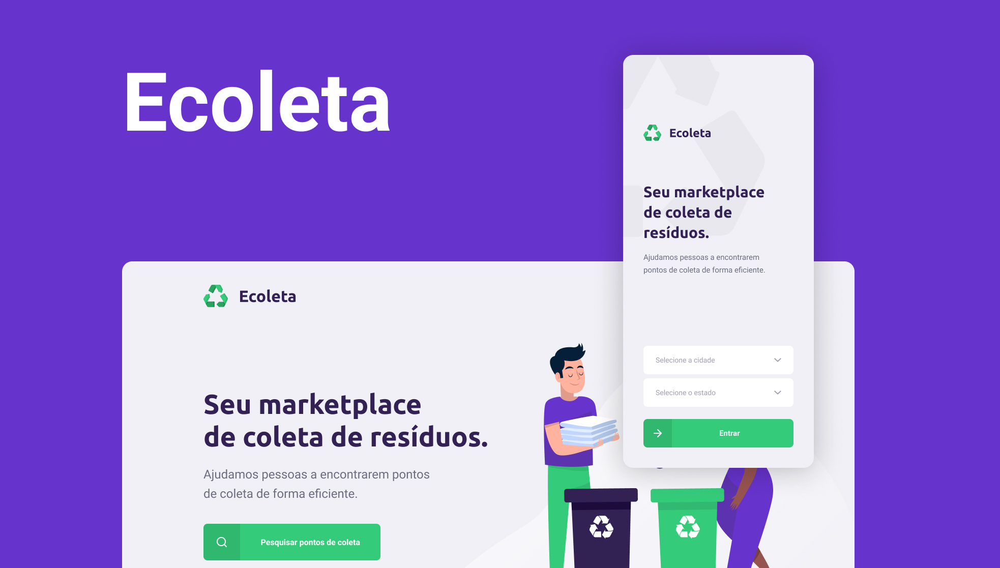

# 

>

<h1 style="color: #888" align="center">
    Ecoleta
</h1>

  
  
  
  

>

## 💻 Project

This project was developed in this international environment week. The propose is to connect companies to make a difference every day.

# 

<!-- >

## 🔖 Layout

<!-- To access the layout use [Figma](https://www.figma.com/file/1SxgOMojOB2zYT0Mdk28lB/). -->

> -->

## 🚀 Technologies

This project was developed with the following technologies:

- Node.js
- TypeScript
- React
- React Native
- Express
- SQLite / Knex
- Leaflet

>

<!-- ## ☁️ External API

The web and mobile project used an external API to load the states and cities of Brazil.

<!-- -  [IBGE](https://servicodados.ibge.gov.br/api/docs/localidades) -->

> -->

## 👊🏼 Contributing

You are totally allowed to contribute with this project. To do that, fork this repository, make your changes and create a pull request.

> >

<h4 align="center">
    Made by <a href="https://www.linkedin.com/in/antoniorrm/" style="color: #00a0df" target="_blank">Antonio Raimundo</a>
</h4>
